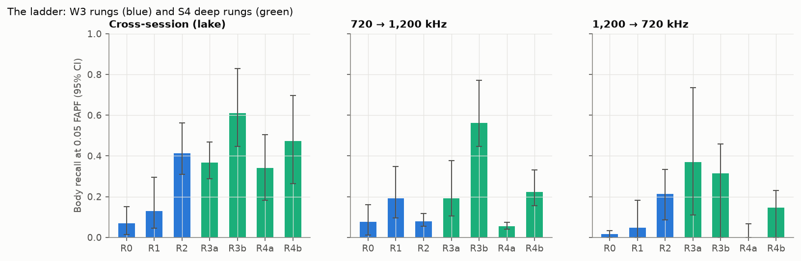

# EchoFind

Submerged-person detection in public sonar data, from raw echoes to a detector on an edge CPU,
tested the way a rescue crew would meet it. A portfolio project for an applied-science role on
handheld rescue sonar. Plan: [docs/PLAN.md](docs/PLAN.md). Two-page report:
[reports/technical_report.pdf](reports/technical_report.pdf).

## In 60 seconds

Published CNNs on side-scan body data reach 97% F1 in-distribution and 47% at unseen sites
(Nga et al., Remote Sensing 16(21):4036, 2024). EchoFind asks why such gaps appear and what
closes them. Every model is scored by object-level recall at a fixed **0.05 false alarms per
frame** (about 1.5 per 30-frame sweep), on splits grouped by session, never random frames.

- **Leakage:** random-frame splits double the apparent recall (0.86 against 0.41 for the same
  model).
- **Model ladder:** a feature model (gradient-boosted trees, 38 physics features) finds
  **0.41** of mannequin bodies at a new session. A 113k-parameter CNN finds **0.61**.
  Pretrained ResNet-50 and MobileNetV3 do worse than the small CNN.
- **Frequency shift breaks every model.** The small CNN recovers most of it (0.56 against
  0.08 at 720 → 1,200 kHz), but misses the pre-registered keep rule in the other direction.
- **Thresholds drift,** off by up to ×5 at a new frequency. Re-setting them from **50–100
  body-free frames** recorded on site restores the false-alarm rate, with no target needed.
- **Mission cost:** the trees cut expected search time from 31 to 23 minutes; the two simplest
  rungs make it longer.
- **Edge:** the C++17 front end matches Python to 3e-7 and handles a 50 m ping in **16 ms at
  p95** on one core, against a 68 ms budget.
- **What to collect next:** an 8-day blocked field trial with paired frequencies. With 48
  placements per arm and the measured ICC, it detects a 0.15 recall difference.

## Results

Body recall at 0.05 false alarms per frame, with 95% cluster-bootstrap intervals by session
(UATD, Gemini 1200ik, one lake, one mannequin):

| Rung | New session | 720 → 1,200 kHz | 1,200 → 720 kHz | Source |
| --- | --- | --- | --- | --- |
| R0 CFAR + size rule | 0.07 [0.01, 0.15] | 0.07 | 0.02 | [W3](reports/w3_ladder.md) |
| R1 logistic, 10 physics features | 0.13 [0.04, 0.30] | 0.19 | 0.05 | W3 |
| R2 gradient-boosted trees, 38 features (shipped) | **0.41** [0.31, 0.56] | 0.08 | 0.21 | W3 |
| R3a 1-D CNN on the range profile | 0.37 [0.29, 0.47] | 0.19 | 0.37 | [S4](reports/s4_deep_rungs.md) |
| R3b 2-D CNN, 113k parameters (best, not kept) | **0.61** [0.45, 0.83] | **0.56** | 0.31 | S4 |
| R4a ResNet-50 frozen / R4b MobileNetV3 | 0.34 / 0.47 | 0.06 / 0.22 | 0.00 / 0.15 | S4 |



## Status

| Workstream | State |
| --- | --- |
| S0 Scaffold: repo, CI, data fetcher | done |
| W1 Signal atlas | NOAA and MBARI done ([atlas](reports/signal_atlas.md), [noise register](reports/noise_register.csv)); UATD analysed in W3–W4; image sections of the atlas not written |
| W2 Physics and DSP front end | done: `echofind.dsp` + `echofind.sim`, tests against closed forms, Pd-vs-SNR, [design note](reports/w2_frontend_design.md) |
| W3 Model ladder | R0–R2 on UATD ([results](reports/w3_ladder.md)); deep rungs R3–R4 in S4 ([report](reports/s4_deep_rungs.md)); R5 multi-look not testable on UATD; Bath [labelling protocol](reports/w3_bath_labelling_protocol.md) written, box labels pending |
| W4 Field-honest evaluation | done on UATD ([report](reports/w4_generalization.md), [model card](reports/model_card.md)): mission cost, recalibration, OOD score, input QA with fault injection, FMEA-lite |
| W5 Edge deployment | done on x86 ([report](reports/w5_edge.md), [edge/](edge/README.md)): parity ≤ 3.1e-7 (float32), 16 ms p95 at 200 kHz; Raspberry Pi timing pending |
| W6 Data strategy | done ([memo](reports/w6_collection_memo.md), [metadata schema](configs/field_metadata.schema.json)) |
| S6 Write-up | [technical report](reports/technical_report.md) ([PDF](reports/technical_report.pdf)), [interview kit](reports/interview_kit.md), [10-slide deck](https://claude.ai/artifact/N8Bbnk2bCAwP2ZvBJmnyUu) (private claude.ai Artifact; share it from its Share menu) |

Every non-obvious choice has a one-page decision record in [reports/decisions/](reports/decisions/).

## Reproduce

```bash
make setup          # uv sync with dev tools
make data-dry       # list files and sizes
make data           # fetch everything (about 15 GB after extraction)
make test           # unit tests, closed-form DSP checks, parity tests if edge/ is built
make atlas          # W1 signal atlas (NOAA, MBARI)
make ladder         # W3: candidates, rungs R0-R2, report figures (about 20 min on 10 cores)
make eval           # W4: QA, generalization, fault injection
make edge           # W5: export, C++ build, golden and parity tests, benchmark
make strategy       # W6: coverage audit, sample size, field design
make deep           # S4: CNN rungs (needs `uv sync --extra dl`; hours on CPU)
uv run --with markdown python scripts/s6_report_pdf.py   # S6: report PDF
```

Seeds are fixed. Every run records its config, git commit and data manifest hash (MLflow,
`mlruns/mlflow.db`, plus a `*_meta.json` next to each result).

## Data

| Source | License | Use |
| --- | --- | --- |
| [UATD forward-looking sonar](https://doi.org/10.6084/m9.figshare.21331143.v3) | CC BY 4.0 | Body vs nine confuser classes; ladder, generalization, edge |
| [Bath side-scan, mannequin](https://researchdata.bath.ac.uk/1467/) | CC BY 4.0 | Leave-one-site-out after labelling (protocol written) |
| [NOAA WCSD, cruise HB2305 EK80](https://registry.opendata.aws/ncei-wcsd-archive/) | NOAA disclaimer | Raw pings for DSP and clutter statistics |
| [MBARI Pacific Sound 256 kHz](https://registry.opendata.aws/pacific-sound/) | CC BY 4.0 | Real ambient noise |

Data is downloaded, never committed. See `configs/data.yaml` for exact files and checksums.

## Limits

- One mannequin in one lake (16 sessions).
- No bodies beyond 12 m.
- The two frequencies come from different sessions.
- No Bath result yet.
- One seed per CNN fold.
- ARM timing is not measured.

All claims are proxy results; [the W6 memo](reports/w6_collection_memo.md) says what data
would turn them into product claims.
