# W1 · Signal atlas

What the raw data contain, before any model is trained. Twelve figures cover active echoes
(NOAA HB2305, Simrad EK80) and ambient noise (MBARI MARS, 256 kHz). The image datasets (UATD and
Bath) are pending because the cloud environment's network policy blocks their hosts (see
[Pending](#pending-uatd-and-bath)). Companion files:

- [`noise_register.csv`](noise_register.csv): 18 entries (source, signature, where seen, mitigation)
- [`w1_variability.csv`](w1_variability.csv): the variability matrix behind F12
- [`w1_clutter_fits.csv`](w1_clutter_fits.csv): Rayleigh, Weibull and K fits for 96 windows
- Decisions [001](decisions/001-mbari-levels-re-full-scale.md) (MBARI levels re full scale) and
  [002](decisions/002-noaa-file-selection-and-noise-window.md) (file choice, impulse filter, noise window)

Reproduce with `make data ONLY="noaa mbari"`, then `scripts/w1_noaa.py`, `scripts/w1_mbari.py` and
`scripts/w1_figures.py` (about 10 minutes on 4 vCPUs).

## Headline findings

1. **H1 is supported. Background is not Rayleigh at broadband resolution.** Rayleigh is rejected
   (ΔAIC > 10) in 90 of 92 NOAA windows. K is the best fit in 67 windows and Weibull in 24. The K
   shape is ν ≈ 0.5 to 0.7 near the bottom, with a scintillation index of 7 to 13 (1 for Rayleigh).
   Only the 18 kHz CW channel, with 0.77 m cells, comes close to Rayleigh in open water. The
   difference comes from cell size: pulse compression shrinks cells to 1 to 7 cm, so each cell
   holds few scatterers and the tails grow heavy. A handheld FM sonar will see the same, which is
   why a fixed threshold fails (F6, F7).
2. **Interference is the largest artefact, and it is not thermal noise.** ES70 shares its band
   with other sounders on the ship. 1 to 15% of its samples are single-ping bursts, and in 10 to
   37% of pings the whole listening window is lifted by 15 to 70 dB. The two-sided impulse filter
   removes the bursts. The noise estimate has to be a median over pings (F2, F3).
3. **The noise floor varies by 17 to 19 dB between files** at 18, 38 and 70 kHz, but by under
   5 dB at 200 kHz. Thresholds have to adapt per session (F4, F12).
4. **The seabed is a stable reference.** Its echo fluctuates 2.3 to 3.0 dB from ping to ping,
   about half the 5.6 dB of Rayleigh fading, so it can serve for gain normalization and for the
   seabed-relative features in W3 (F5).
5. **Quiet ambient noise in the sonar band is Gaussian; a nearby boat is not.** The 60 to 120 kHz
   envelope is Rayleigh in January, April and July. With a vessel nearby in September, levels rise
   10 to 15 dB, a 12 kHz sounder appears and the tail turns K (ν = 1.8). Persistent tones at
   86, 103 and 120 kHz appear in every season (F8 to F11).

## Data used

| Source | Files | What it gives |
| --- | --- | --- |
| NOAA HB2305 EK80 | 8 `D*.raw` files evenly spaced over 21 to 26 July 2023, plus the 2 `ComplexSamples-*` files of 24 July | Complex FM samples for ES38 (34–45 kHz), ES70 (45–90 kHz) and ES200 (160–260 kHz) in every file, and ES18 18 kHz CW; 19 to 184 pings per file at 1 ping/s; shelf seabed 27 to 39 m below the transducer |
| MBARI MARS | One 10-minute file per season in 2024 (15 Jan, 15 Apr, 15 Jul, 15 Sep; October is missing from the archive) | 256 kHz, 24-bit hydrophone at 891 m in Monterey Bay; usable to about 100 kHz |

Two corrections to the scaffold: the `D*.raw` files are FM, not CW-only, and the first 8 `D*.raw`
keys are 20-second dockside files from Newport. The fetcher now spreads its picks over the cruise
(decision 002).

## Echosounder pings (NOAA)

### F1 · Where the files come from
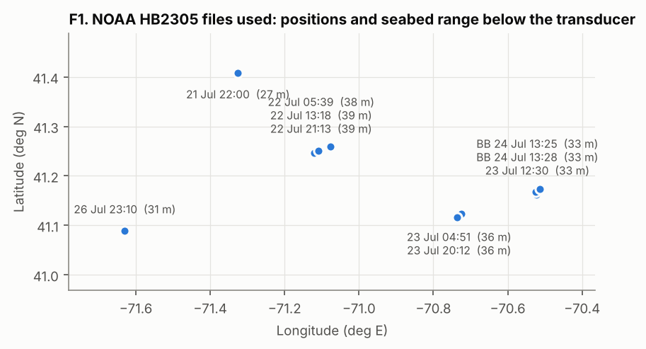

Five sites over 120 km of the southern New England shelf, 27 to 39 m deep. Site, time of day and
depth all vary, which gives the variability matrix (F12) something to resolve.

### F2 · Echograms per frequency
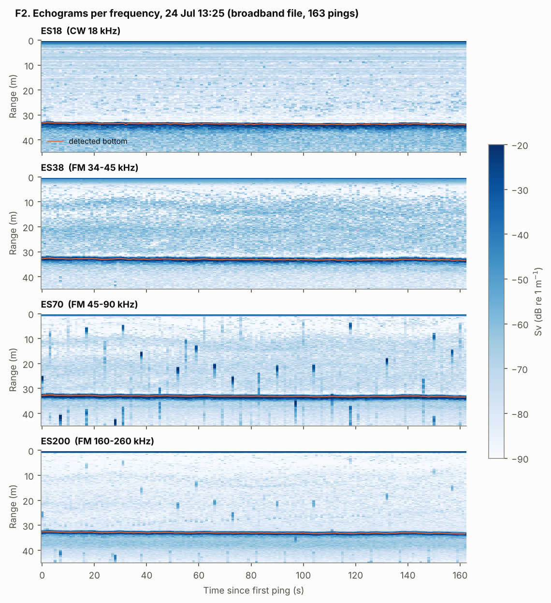

The seabed is the dominant echo on every channel. Two things stand out. First, ES70 carries
vertical bursts about 2 m long at random ranges, single-ping interference that also bleeds into
ES200. Second, ES38 shows diffuse scattering layers at 10 to 30 m (fish and plankton). Echograms
are plotted without the impulse mask so the interference stays visible.

### F3 · Level vs range, before and after TVG
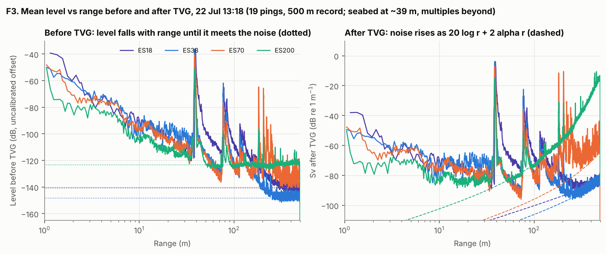

Before TVG, the received level falls with range until it meets each channel's noise floor
(dotted). The floor sits at about 45 m for ES200 and 150 to 250 m for the lower frequencies. The
seabed at 39 m and its multiples at 78 and 117 m are the spikes. After TVG
(Sv = level + 20 log r + 2αr) the same noise rises along the dashed curves. At 200 kHz it overtakes
the water-column signal beyond about 70 m, because absorption (about 50 dB/km) dominates. This
curve sets the useful range of each frequency, which is the trade behind a handheld's
10/20/50 m modes. The ES70 trace beyond 150 m shows the multi-ping interference.

### F4 · Noise floor and seabed SNR by file
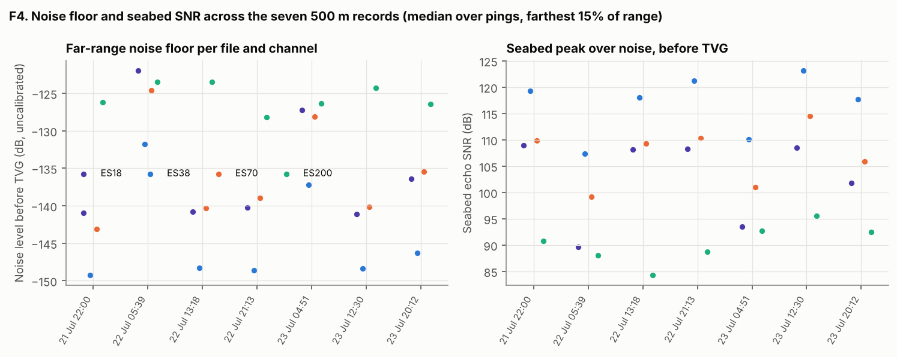

The noise is the median over pings of the level before TVG, taken over the farthest 15% of the
500 m records (decision 002). Levels are relative, with uncalibrated offsets, so compare across
files, not across channels. At 18, 38 and 70 kHz, two files (22 Jul 05:39 and 23 Jul 04:51) are
17 to 19 dB noisier than the quietest. ES200 stays within 5 dB. The seabed SNR at 200 kHz is 20 to
30 dB below 38 kHz.

### F5 · Ping-to-ping fluctuation
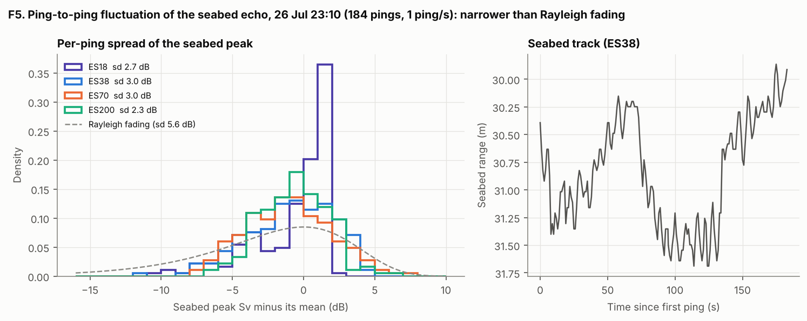

Over 184 pings, the seabed peak varies by 2.3 to 3.0 dB (sd) on all four channels. A Rayleigh
fading echo would vary by 5.6 dB, so the seabed behaves like a strong, partly coherent return. The
seabed range drifts 1.5 m in 3 minutes (terrain and ship motion), so features should be measured
relative to a tracked seabed, not a fixed range.

## Clutter statistics (H1)

### F6 · Envelope exceedance with model fits
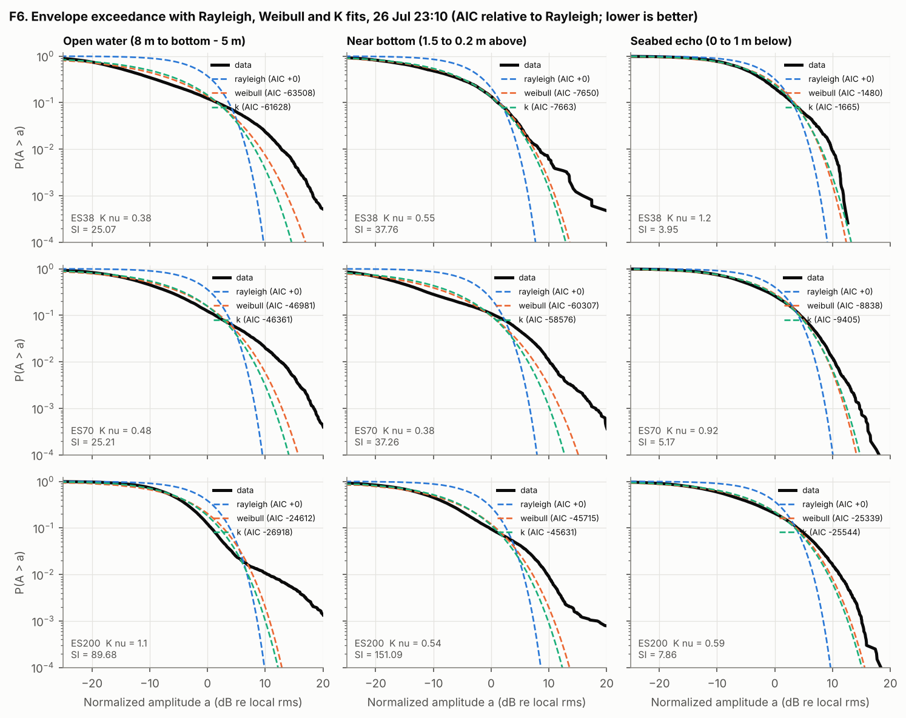

Amplitudes are normalized by the local mean intensity: all pings, ±0.25 m. Samples are thinned to
one per range-resolution cell (c/2B for FM) to limit correlation between samples, and pings
flagged by the impulse filter are excluded. Rayleigh (blue) is far too light-tailed in every
window. K and Weibull track the body of the distribution. In open water and near the bottom the
data still exceed both above P ≈ 10⁻², where fish and other discrete targets add a second
component. The AIC values are relative to Rayleigh. Some correlation remains between cells, which
likely inflates the size of these differences, so the claim rests on the ranking, not on the
values.

### F7 · H1 across all files
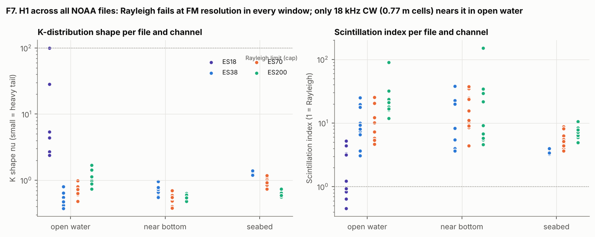

| Median K shape ν | Open water | Near bottom | Seabed echo |
| --- | --- | --- | --- |
| ES18 (CW, 0.77 m cell) | 28 (near Rayleigh) | too few cells | too few cells |
| ES38 (FM, 6.8 cm) | 0.48 | 0.65 | 1.30 |
| ES70 (FM, 1.7 cm) | 0.66 | 0.51 | 0.98 |
| ES200 (FM, 0.75 cm) | 1.08 | 0.59 | 0.65 |

**H1 verdict.** Supported for the background near the bottom: Rayleigh is rejected
(ΔAIC > 10) in all 30 near-bottom windows, with K preferred in 20 and Weibull in 10. The plan expected heavier tails near the
bottom than in open water. That holds only at 200 kHz. At 38 and 70 kHz the open water is about as
heavy-tailed, because fish layers dominate there. UATD background cells, the second half of the H1
test, are still to be done.

## Ambient noise (MBARI)

Levels are in dB re full scale (decision 001).

### F8 · Welch PSD by season
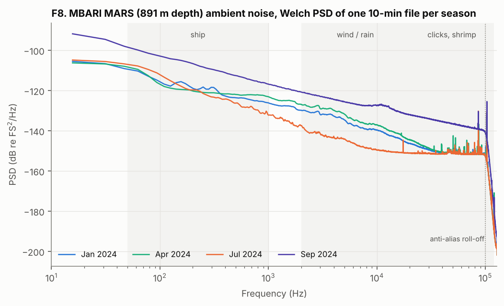

The spectra slope down by about 13 dB per decade from 50 Hz to 10 kHz. Above about 10 kHz the
July file reaches the recorder's electronic floor (about −151 dBFS²/Hz). Narrowband lines at 86,
103 and 120 kHz appear in every season. Everything above 100 kHz is the anti-alias roll-off, so
MBARI cannot describe noise at handheld frequencies (100 to 800 kHz). That part has to come from
the simulator's thermal term. September is 10 to 15 dB louder across the whole band.

### F9 · Whitened spectrograms
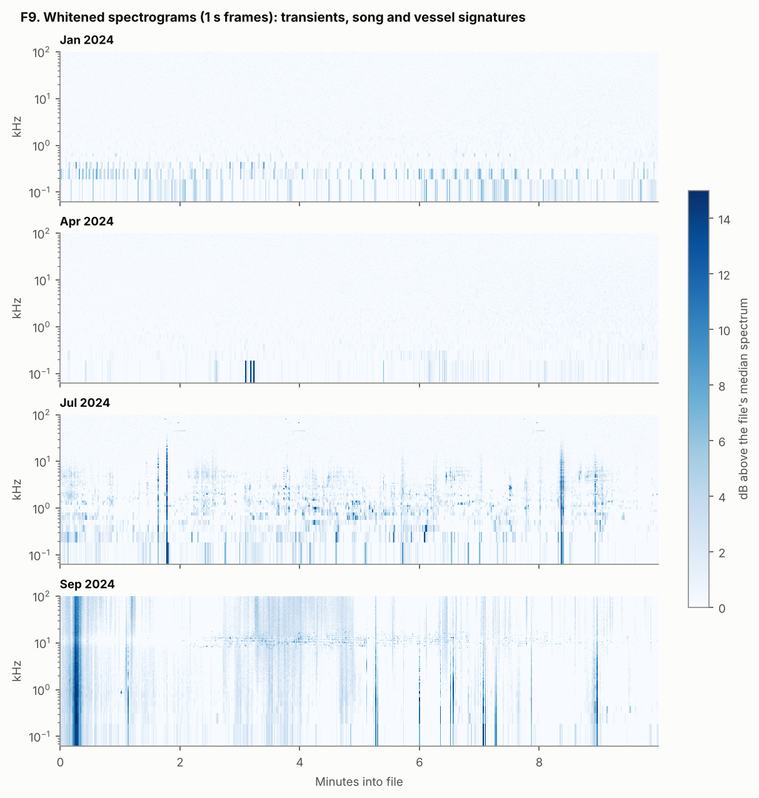

Each panel is shown as dB above its own median spectrum. **January and April** are steady, with
only low-frequency flicker below 500 Hz. **July** has song-like units at 0.2 to 5 kHz (probably
humpback whale, which is seasonal in Monterey Bay in July; to be confirmed by listening) and two
broadband transients reaching 20 to 30 kHz. **September** has a ping train at 11 to 12 kHz from
minute 2.5 on, typical of a ship's echosounder, together with broadband transients and a loud
event at 0.3 min: a vessel nearby.

### F10 · Band levels and impulse rate
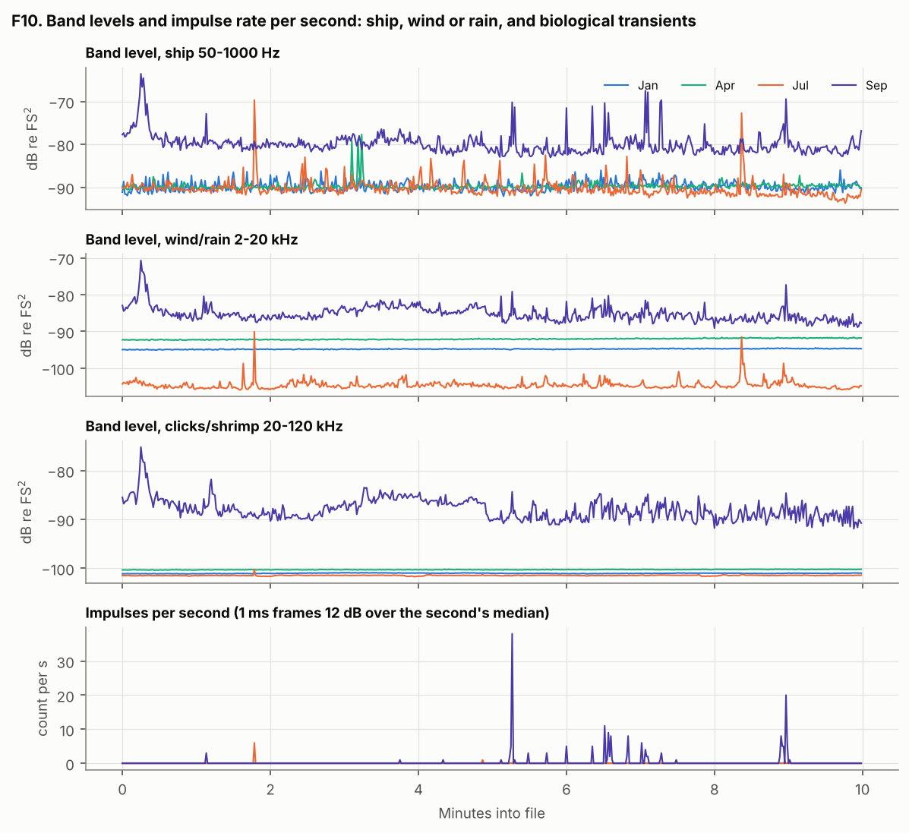

| Season | 50–1000 Hz median (spread p95−p5) | 2–20 kHz | 20–120 kHz | Tones found |
| --- | --- | --- | --- | --- |
| Jan | −90.0 dBFS (3.4 dB) | −94.8 (0.4) | −101.0 (0.2) | 6 |
| Apr | −89.9 (1.4) | −92.1 (0.6) | −100.3 (0.1) | 8 |
| Jul | −90.7 (5.1) | −104.9 (2.6) | −101.5 (0.2) | 8 |
| Sep | −80.4 (6.0) | −85.5 (5.7) | −88.3 (5.9) | 4 |

Impulses (1 ms frames 12 dB above the median of their second) appear almost only in September.
No rain signature (a broad hump at 10 to 20 kHz) was found in these four files.

### F11 · Noise envelope in the sonar band
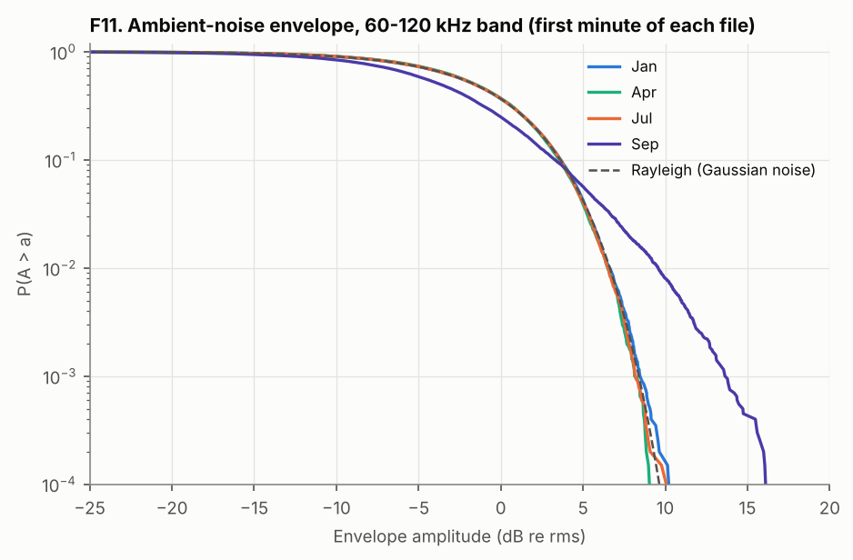

When the sea is quiet, the 60 to 120 kHz envelope follows Rayleigh down to 10⁻⁴ (SI 0.95 to
1.01). With the vessel nearby it turns heavy-tailed (K ν = 1.8, SI = 4.0). The simulator needs
both modes.

## Variability matrix

### F12 · Files × (frequency, metric)
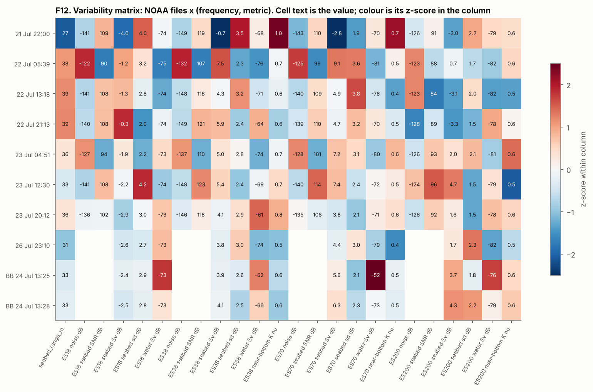

The largest sources of variation, ranked:

1. **Time and session.** The noise floor varies 17 to 19 dB at 18 to 70 kHz.
2. **Frequency.** Seabed SNR differs by 20 to 30 dB between 38 and 200 kHz, and the
   water-column Sv by up to 20 dB (fish layers are strongest at 38 kHz).
3. **Interference occupancy**, from 0 to 37% of ES70 pings.
4. **Site and depth.** The seabed Sv varies 4 to 12 dB across files, depending on frequency
   (seabed 27 to 39 m below the transducer). The ES70 water-column value of −52 dB in the
   24 Jul 13:25 file is residual interference, not biology.

Not yet covered: sensor (UATD versus Bath versus EK80) and a range axis for targets, both of which
need the image datasets.

## Pending: UATD and Bath

`ndownloader.figshare.com` (UATD) and `researchdata.bath.ac.uk` (Bath) return HTTP 403 from the
environment's egress proxy. To unblock them, add `figshare.com`, `*.figshare.com` and
`researchdata.bath.ac.uk` to the environment's allowed domains (docs/cloud-setup.md). Two steps are
then ready to run:

- `uv run python scripts/w1_bath_inventory.py --remote` reads only the zip's central directory
  (about 1 MB, through HTTP Range requests). It writes `reports/bath_inventory.csv` with image
  counts per folder, whether each folder holds a `target/` subdirectory, the frequency (450 or
  990 kHz) and the survey date. This answers which folders kept their labels, which W3's
  labelling protocol needs. Tested offline in `tests/test_bath_inventory.py`.
- Image figures still to add (F13 to F15): speckle statistics and gain artefacts per frame, the
  side-scan nadir gap and acoustic shadows, and mannequin versus tyre and cylinder at 720 and
  1200 kHz, with background cells added to the H1 fits.

## Follow-ups

- **F1.** Absolute MBARI levels need MBARI's MARS calibration file (decision 001).
- **F2.** W2's simulator should take its clutter from the near-bottom K fits here
  (ν ≈ 0.5 to 0.7 at cm resolution) and its noise from the Gaussian (quiet) and K (vessel) modes.
- **F3.** H3 (CFAR at clutter edges) can use the seabed transitions in these files. The
  impulse-masked Sv is cached in `data/interim/w1/noaa/` (not committed).
