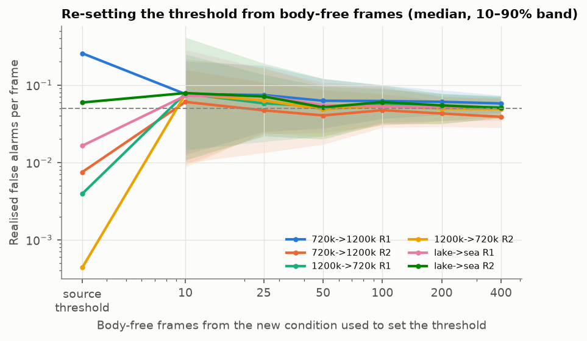

**Summary.** EchoFind is a handheld-class sonar pipeline that runs from raw echoes to a
detector on an edge CPU. It is evaluated the way a rescue crew would meet it: at new sessions,
a new frequency and a new site, at a fixed false-alarm rate, against mission time.

- **Detection:** on the UATD forward-looking sonar data, a gradient-boosted model on 38 physics
  features finds 0.41 of mannequin bodies at a new session, at 0.05 false alarms per frame.
  A 113k-parameter CNN finds 0.61.
- **Frequency shift:** changing frequency breaks every model. The small CNN recovers the most,
  but misses the pre-registered keep rule on one of three tests.
- **Calibration and edge:** re-setting the threshold from 50–100 body-free frames restores the
  false-alarm rate at a new site without any target. The C++ front end matches Python to
  3e-7 and processes a 50 m ping in 16 ms at p95 on one core, against a 68 ms budget.
- **Next data:** an 8-day blocked field trial with paired frequencies. Its sample size is set
  from an intraclass correlation measured on the data.

## 1. Problem and data

The posting asks for detection that holds across environments, with misses and false alarms
both counted. A published CNN on the Bath side-scan data averaged 97% F1 in-distribution but
47% on unseen sites (Nga et al., 2024). EchoFind asks why such gaps appear and what closes them.

Four public sets were used:
- **NOAA HB2305 (EK80 raw pings):** DSP and clutter statistics.
- **MBARI 256 kHz:** real ambient noise.
- **UATD:** Gemini 1200ik, 720 and 1,200 kHz, 9,200 frames, one human-body mannequin among nine
  confuser classes.
- **Bath side-scan:** 73 mannequin legs at two sites, kept for later.

The Bath archive has lost its target positions, so UATD is the detection set, and Bath has a
written labelling protocol (decision 202). UATD logs no site or session; both were inferred
from the logged sound speed and range setting (decision 201). Bodies exist only at the lake.

## 2. Method

**Signal first (W1, W2).** NOAA background is heavier-tailed than Rayleigh in 90 of 92 windows
(K shape ν ≈ 0.5–0.7 near the bottom), so fixed thresholds fail. The front end runs IQ
demodulation, an FFT matched filter, TVG and CA/GO/OS-CFAR, each checked against closed forms
in CI: pulse-compression gain within 0.7 dB of 10 log BT, and Pfa within Monte Carlo error.
Near the bottom a body is reverberation-limited, not noise-limited.

**A ladder with a keep rule (W3, S4).**
- **Shared candidates:** OS-CFAR candidates (23 per frame, 99.7% of bodies proposed) feed every
  rung.
- **The rungs:** a CFAR + size rule (R0), logistic regression on 10 physics features (R1),
  LightGBM on 38 features (R2), 1-D and 2-D CNNs (R3a, R3b), and a frozen ResNet-50 and a
  fine-tuned MobileNetV3 (R4a, R4b).
- **Scoring:** object-level recall at 0.05 false alarms per frame, every non-body candidate
  counted as an alarm, 95% cluster bootstrap by session.
- **Keep rule:** a rung is kept only if it beats the one below on cross-session and both
  cross-frequency tests, with paired intervals above zero. The operating point and the rule
  were committed before any result.

## 3. Results

| Rung | New lake session | 720 → 1,200 kHz | 1,200 → 720 kHz |
| --- | --- | --- | --- |
| R0 rule / R1 logistic | 0.07 / 0.13 | 0.07 / 0.19 | 0.02 / 0.05 |
| R2 trees, 38 features | 0.41 [0.31, 0.56] | 0.08 [0.05, 0.12] | 0.21 [0.09, 0.33] |
| R3a 1-D CNN (range profile) | 0.37 [0.29, 0.47] | 0.19 | 0.37 |
| **R3b 2-D CNN, 113k params** | **0.61 [0.45, 0.83]** | **0.56 [0.45, 0.77]** | 0.31 [0.00, 0.46] |
| R4a ResNet-50 frozen / R4b MobileNetV3 | 0.34 / 0.47 | 0.06 / 0.22 | 0.00 / 0.15 |

**Findings.**
1. **Random-frame splits overstate recall 2×:** R2 scores 0.86 on random frames and 0.41
   across sessions. Near-duplicate frames sit closer in feature space under the random split.
2. **Each simple rung earns its place across sessions,** and R2 beats R1 by +0.28 [+0.18, +0.39].
3. **Frequency shift breaks every hand-built model.** The small 2-D CNN gains +0.48 over R2 at
   720 → 1,200 kHz, but +0.10 [−0.09, +0.25] in the other direction. It misses the rule
   (decision 602), so R2 remains the shipped model.
4. **Bigger pretrained networks do worse.** The single-beam 1-D CNN only ties R2, so the gain
   needs a 2-D view.
5. **Shadow features are irreplaceable** (dropping them costs 0.09 recall). Extent features are
   heavily used but redundant. False alarms come from placed confusers (balls, tyres, cages),
   not open water.

## 4. What a crew would see (W4)

- **Search time** = scan time + false alarms × check time + misses × re-search time. Under
  default times, R2 cuts expected search time from 31 to 23 minutes, while R0 and R1 make it
  longer. The best false-alarm rate ranges from 0.008 to 0.54 per frame depending on check and
  re-search costs, so the threshold must come from field numbers.
- **Thresholds drift with conditions:** a source threshold gives 0.0004 to 0.26 false alarms
  per frame at a new frequency. Re-setting it from 50–100 body-free frames brings it to
  0.05 ± ×2 at every shift tested. Body-free frames need no target, so a crew can record them
  on arrival.
- **Calibration where it matters:** ECE is 0.01 over all candidates but 0.09–0.43 among
  candidates scored at p ≥ 0.05.
- **Safety:** under injected faults, input QA catches dropped rows, dead beams and low gain on
  every frame, but only 56% of saturated frames and no boat wake. An OOD score adds 53% of wake
  frames. Saturation costs 9 recall points. A model card holds a 10-row hazard table.

## 5. Edge (W5)

- **Parity:** a C++17 port (zero-phase SOS filtering identical to SciPy, an FFT matched filter,
  CFAR, TVG) matches Python to ≤ 2e-11 in double and ≤ 3.1e-7 in float32. R2 is compiled to C
  with float thresholds rounded down, so float inputs take the same branches; the float32 cost
  is −0.002 recall.
- **Latency:** a 200 kHz, 50 m ping takes 16.4 ms at p95 on one pinned x86 core (24% of 68 ms),
  and 6.1 ms at 80 kHz. R3b would add 8.4 ms.
- **int8:** R3b loses 0.017 recall and shrinks 3.3×, but is not faster on this CPU. Raspberry Pi
  timing is pending.

## 6. Limits and what to collect next (W6)

**Limits.**
- One mannequin, in one lake, in 16 sessions.
- No bodies beyond 12 m.
- The two frequencies were recorded in different sessions.
- No Bath number until its legs are boxed.
- One seed per CNN fold.

**Next.** The proposed trial runs 4 sites (one per bottom type) × 2 days: 144 body-proxy
placements, both frequencies on every ping, a tissue phantom beside a mannequin, confusers,
body-free sweeps and timed checks. With 48 placements per arm, it detects a 0.15 recall
difference with power 0.89 at the measured ICC (0.12) and 0.52 at a conservative 0.5. A pilot
day sets the final size, and a pre-registered sim-to-real test decides whether simulation may
serve as training data.
