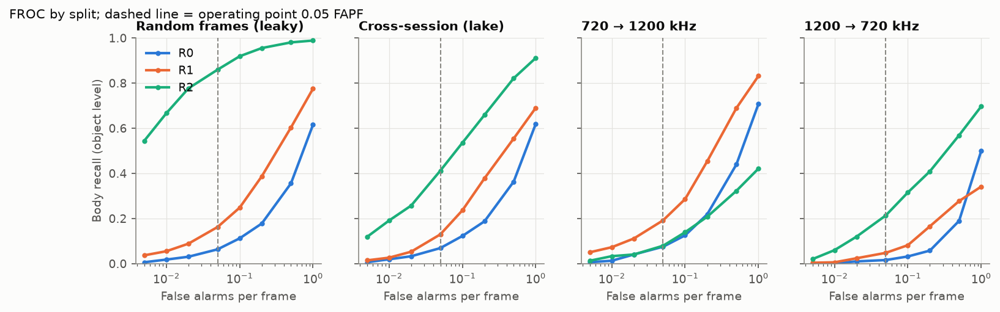
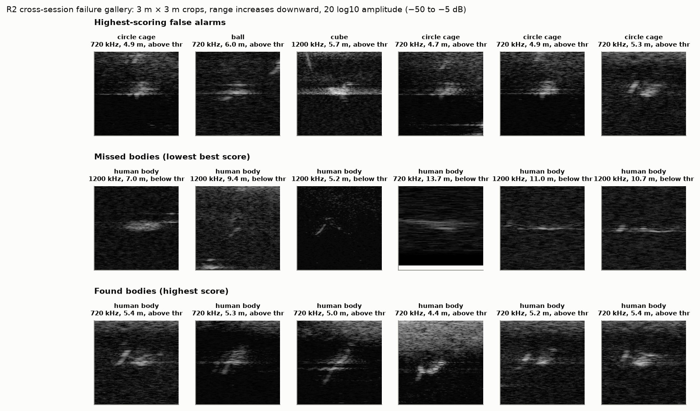
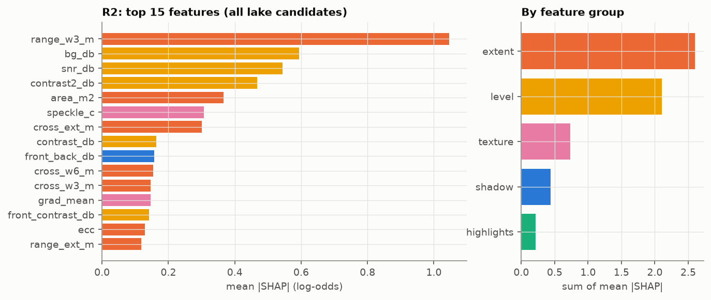

# W3 checkpoint: model ladder R0 to R2 on UATD

Rungs R0 (rule), R1 (logistic, 10 physics features) and R2 (boosted trees, 38 features)
separate the UATD human-body model from nine confuser classes and background clutter, at a
fixed 0.05 false alarms per frame. Each rung was trained and scored on splits grouped by
session, never by random frames. Rungs R3 to R5 are the next session (S4).

**Bottom line.** Within the lake, R2 is the only usable rung: 0.41 recall at 0.05 false alarms
per frame across sessions [0.31, 0.56]. R1 reaches 0.13 and R0 0.07, and each step up the
ladder is significant. Random-frame splits overstate R2 by a factor of two (0.86), which
reproduces H4. Across frequency, every rung fails (recall at most 0.21), and a threshold set
at one frequency misses its false-alarm target by up to 5× at the other. No rung meets the
pre-registered keep rule on both shifts, so the ladder has no winner yet. This is the Nga et al.
pattern again, on a different sensor: good in-distribution, poor under shift.

Reproduce: `uv run python scripts/w3_candidates.py && uv run python scripts/w3_ladder.py &&
uv run python scripts/w3_report.py` (about 20 minutes on 10 cores). Decisions:
[201](decisions/201-uatd-site-and-session.md) (groups),
[202](decisions/202-uatd-primary-bath-protocol.md) (UATD primary; Bath protocol),
[203](decisions/203-fls-proposals-and-operating-point.md) (scoring and operating point, fixed
before results).

## Setup

- **Data:** all 9,200 UATD frames pooled (official splits share sessions). The lake has 6,949
  frames with 1,434 body objects; the sea has 2,251 frames and no bodies.
- **Candidates:** OS-CFAR proposals on range-normalised, block-averaged frames. That gives 211k
  candidates (23 per frame) and proposes 99.7% of body objects and 97–99% of every other class
  ([`w3/candidates_summary.json`](w3/candidates_summary.json)).
- **Scoring:** object-level body recall at 0.05 false alarms per frame. Every candidate not on
  a body is a false alarm, including those on confuser objects. Intervals are 95% cluster
  bootstrap by session (1,000 draws). Differences between rungs use a paired bootstrap on the
  same draws.
- **Splits:** *random* (5-fold over lake frames, leaky, kept for H4); *cross-session* (hold out
  one of the four lake frequency × range-band groups that contain bodies); *cross-frequency*
  (720 → 1,200 kHz and the reverse); *sea* (train on the lake, count false alarms at sea).

## Results table

Recall @ 0.05 FAPF uses the threshold that gives 0.05 false alarms per frame on the test data
(ranking quality). "Transferred" applies the threshold chosen from out-of-fold training scores,
as a fielded device would. ECE is candidate-level (R0 gives no probability).

| Split | Rung | Bodies | Recall @ 0.05 FAPF [95% CI] | PR-AUC | Transferred recall / FAPF | F1 (transferred) | ECE |
| --- | --- | --- | --- | --- | --- | --- | --- |
| random (leaky) | R0 | 1,434 | 0.06 [0.01, 0.14] | 0.12 | 0.06 / 0.050 | 0.10 |  |
| random (leaky) | R1 | 1,434 | 0.16 [0.05, 0.35] | 0.26 | 0.14 / 0.041 | 0.21 | 0.002 |
| random (leaky) | R2 | 1,434 | **0.86** [0.79, 0.95] | 0.90 | 0.88 / 0.056 | 0.81 | 0.004 |
| cross-session | R0 | 1,434 | 0.07 [0.01, 0.15] | 0.14 | 0.07 / 0.049 | 0.11 |  |
| cross-session | R1 | 1,434 | 0.13 [0.04, 0.30] | 0.22 | 0.14 / 0.050 | 0.20 | 0.003 |
| cross-session | R2 | 1,434 | **0.41** [0.31, 0.56] | 0.54 | 0.36 / 0.036 | 0.48 | 0.010 |
| 720 → 1,200 kHz | R0 | 933 | 0.07 [0.01, 0.16] | 0.15 | 0.23 / **0.216** | 0.20 |  |
| 720 → 1,200 kHz | R1 | 933 | 0.19 [0.09, 0.35] | 0.31 | 0.52 / **0.257** | 0.37 | 0.017 |
| 720 → 1,200 kHz | R2 | 933 | 0.08 [0.05, 0.12] | 0.11 | 0.02 / 0.007 | 0.04 | 0.019 |
| 1,200 → 720 kHz | R0 | 501 | 0.02 [0.00, 0.03] | 0.07 | 0.00 / 0.007 | 0.00 |  |
| 1,200 → 720 kHz | R1 | 501 | 0.05 [0.00, 0.18] | 0.08 | 0.00 / 0.004 | 0.00 | 0.009 |
| 1,200 → 720 kHz | R2 | 501 | 0.21 [0.09, 0.33] | 0.28 | 0.00 / 0.000 | 0.00 | 0.025 |

Full table with the H5 variant: [`w3/ladder_table.md`](w3/ladder_table.md); raw numbers in
[`w3/ladder_results.csv`](w3/ladder_results.csv); FROC points in [`w3/froc.csv`](w3/froc.csv).

### Keep rule (paired cluster bootstrap, recall difference at 0.05 FAPF)

| Comparison | Cross-session | 720 → 1,200 kHz | 1,200 → 720 kHz |
| --- | --- | --- | --- |
| R1 − R0 | +0.06 [+0.02, +0.16] ✔ | +0.12 [+0.07, +0.22] ✔ | +0.03 [0.00, +0.18] ✘ |
| R2 − R1 | +0.28 [+0.18, +0.39] ✔ | −0.11 [−0.29, +0.00] ✘ | +0.17 [0.00, +0.24] ✘ |
| R2 − R0 | +0.34 [+0.26, +0.46] ✔ | +0.00 [−0.09, +0.08] ✘ | +0.20 [+0.09, +0.31] ✔ |

The rule from decision 203 needs a win on cross-session and on both cross-frequency directions.
No rung passes it. R2 wins inside one frequency, and R1 is the better rung for 720 → 1,200 kHz.
Source: [`w3/ladder_paired.csv`](w3/ladder_paired.csv).

### Cross-session, by held-out group

| Held out | Frames | Bodies | R0 | R1 | R2 |
| --- | --- | --- | --- | --- | --- |
| 720 kHz, 10 m | 1,375 | 224 | 0.03 | 0.08 | 0.50 |
| 720 kHz, 15 m | 809 | 277 | 0.00 | 0.02 | 0.26 |
| 1,200 kHz, 10 m | 2,603 | 464 | 0.13 | 0.41 | 0.58 |
| 1,200 kHz, 15 m | 1,624 | 469 | 0.03 | 0.04 | 0.33 |

The 15 m range setting is harder at both frequencies. At 15 m a body covers fewer beams and
less of its shadow is visible.

### New site: false alarms at sea (no bodies there)

| Rung | Transferred FAPF at sea | Main sources |
| --- | --- | --- |
| R0 | 0.020 | background 39, ROV 4 |
| R1 | 0.016 | background 31, cube 4 |
| R2 | **0.060** (target 0.05) | **planes 60**, background 70 |

R2 alarms on the aircraft model, a class that never appears in the lake. Its false-alarm rate
holds only roughly at the new site, and the excess comes from a new object type, not from the
new water. A device needs an out-of-distribution check (W4) rather than trusting the lake
threshold. Source: [`w3/sea_false_alarms.csv`](w3/sea_false_alarms.csv).

## Hypotheses tested here

- **H4 (random splits overstate): supported.** R2 recall falls from 0.86 (random frames) to
  0.41 (cross-session) with the same model and features. Under the random split, test bodies
  sit closer to a training body in feature space: median nearest-neighbour distance 2.37
  versus 2.94 standardised units ([`w3/h4_near_duplicates.csv`](w3/h4_near_duplicates.csv)).
  Neighbouring frames of one pass are near-copies of each other, and the random split hands
  them to both sides.
- **H5 (physics normalisation narrows the cross-site gap): not supported at this rung.** R2 on
  range-normalised features beats R2 on raw power by +0.06 [−0.05, +0.12] cross-session and by
  −0.01 to +0.04 cross-frequency, with no interval clear of zero. The comparison with R4
  (a larger network) is S4's half of H5. Normalisation does keep the transferred false-alarm
  rate closer to target cross-session (0.036 versus 0.075).
- **H6 (shadow and extent carry the separability): half supported.** Dropping the shadow group
  costs 0.09 recall [+0.01, +0.18], and dropping the level group costs 0.09 [+0.01, +0.16].
  Dropping the extent group costs nothing (−0.01 [−0.13, +0.12]), even though SHAP ranks extent
  first. Extent is used heavily but is redundant with level and highlight features, while
  shadow carries information no other group has. See the feature page below.

## Failure gallery (R2, cross-session)

- **False alarms are confusers, not clutter.** At the cross-session threshold, R2's false
  alarms are balls (38), tyres (46), circle cages (28) and other placed objects; 73 of 100k
  background candidates pass. The top false alarms are cages and balls at 4.7–6 m, at the same
  range and with the same bright, compact look as the best-detected bodies
  ([`w3/confusers_cross_session.csv`](w3/confusers_cross_session.csv)). R0 confuses cubes and
  balls; R1 confuses balls and tyres.
- **Misses are long, thin returns at 1,200 kHz, 7–11 m.** The body shows as a single line of
  highlight with little shadow, which matches the extent and shadow features of a pipe or the
  bottom. The found bodies are mostly 720 kHz at about 5 m with a clear multi-part shape.
- **A fixed-range seam.** Several crops show a horizontal line across all beams at one range.
  It looks like an artefact of the sonar or its export. It sits in both classes, so the model
  cannot use it to tell them apart, but it inflates candidate counts near it. This is logged
  for the W1 noise register.

## Feature importance (R2)

SHAP on R2 trained on all lake candidates (1,500 body and 3,000 other candidates explained)
ranks the −3 dB range width first, then local background level, CFAR SNR and wide-ring contrast
([`w3/shap_importance.csv`](w3/shap_importance.csv)). By group, extent and level carry most of
the attribution, then texture, shadow and highlights. Read together with the drop-one-group
ablation: shadow is a small but irreplaceable signal, and extent is large but substitutable.
For AquaEye's 1D echoes, this argues for keeping a range-extent measure and a behind-target
(shadow) measure in any feature set.

## What this means for the plan

1. **Frequency shift is the problem to solve first.** It breaks every rung and every
   threshold. For a dual-frequency product, the data plan (W6) should collect bodies at both
   frequencies in the same sessions. It should also test per-frequency thresholds, or
   frequency-normalised features such as range widths in units of the pulse length, before
   reaching for a bigger model.
2. **R3/R4 (S4) should be judged on the same splits and keep rule.** The question is not
   whether a CNN beats 0.41 cross-session, but whether it closes the cross-frequency gap.
3. **Confuser objects, not background, set the false-alarm rate.** Hard-negative collection
   (tyres, balls, cages near a body) is worth more than more empty-water frames.
4. **Bath stays open.** A real new-site recall needs Bath labels
   ([protocol](w3_bath_labelling_protocol.md); about 4–6 reviewer hours).

## Limits

- UATD bodies are one mannequin, in one lake, in four sessions. The intervals are wide because
  only four session groups hold bodies. Cluster resampling by inferred session may still be
  too optimistic if neighbouring sessions are one recording (decision 201).
- Proposal settings were picked on a sample spanning all groups. They gave the same body recall
  at every setting tried, and all rungs share them.
- ECE is low mostly because 99% of candidates are easy negatives. A per-class reliability check
  belongs to W4.
- Runs are tracked in MLflow (`mlruns/mlflow.db`, local, not committed), with config, git commit
  and data hash. The same metadata is in [`w3/ladder_meta.json`](w3/ladder_meta.json).
