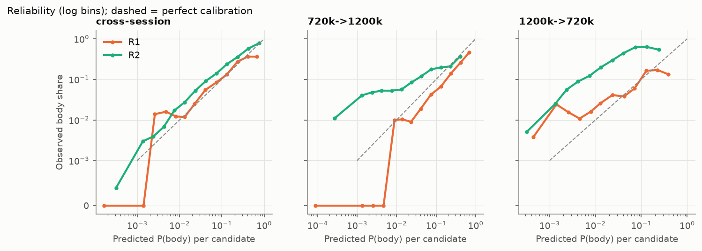
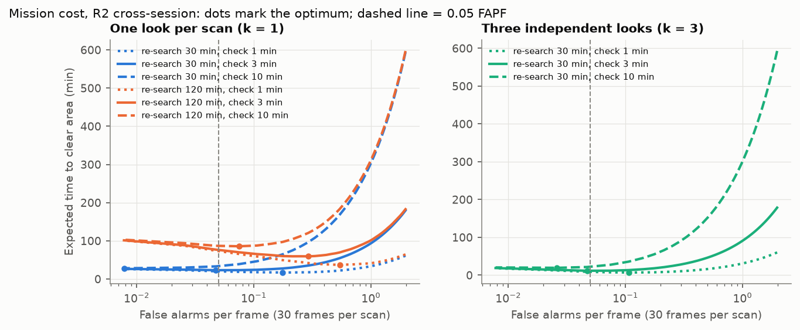

# W4: generalization report (what a rescue crew would see)

This report evaluates the W3 ladder (R0 rule, R1 logistic, R2 boosted trees) on UATD as a crew
would meet it: at new sessions, a new frequency and a new site, by range, in mission time, and
when the input is damaged. Model card: [model_card.md](model_card.md). Decisions:
[301](decisions/301-mission-cost-parameters.md) (mission cost),
[302](decisions/302-ood-rescan-score.md) (OOD score),
[303](decisions/303-threshold-from-body-free-frames.md) (recalibration).

**Bottom line.**
1. At a new lake session, R2 finds 0.41 of bodies [0.31, 0.56] at 0.05 false alarms per frame
   (1.5 per 30-frame sweep). It is the only rung that shortens a search, about 8 minutes off a
   31-minute baseline under default assumptions. R0 and R1 make searches longer.
2. A frequency change breaks every rung, and its false-alarm rate breaks with it. Re-setting the
   threshold from 50–100 body-free frames recorded at the new condition restores the
   false-alarm rate to within about ×2 of target. That needs no body and no retraining.
3. Where the threshold should sit depends on what a check and a miss cost: the optimum ranges
   from 0.008 to 0.54 false alarms per frame over plausible costs. It must be set from field
   numbers, not fixed in the lab.
4. Input QA catches dropped rows, dead beams and low gain, but only half of saturated frames
   and no boat wake. The OOD score adds wake (53%) and novel objects, but it does not predict
   the frequency-shift failure.

Reproduce: `make eval` (after `make ladder`). Tests: `tests/test_w4.py` (cost formula, OOD
on Gaussians, QA padding versus drops).

## 1. Splits and what each one measures

| Plan split | Status | Why |
| --- | --- | --- |
| Leave one site out, Bath | not run | No box labels yet ([protocol](w3_bath_labelling_protocol.md), decision 202) |
| Lake → sea, UATD | false alarms only | No bodies at sea (decision 201) |
| 720 ↔ 1,200 kHz, UATD | done | Same lake, the other frequency |
| New session, UATD lake | done | Leave out one frequency × range group |
| SCTD, FLS victim sets | not run | Optional; first in the plan's cut order. Unlicensed, so evaluate only |

All intervals are 95% cluster bootstrap by session. Where a cell has fewer than 3 sessions with
bodies, it gets no interval.

## 2. Per-condition performance

### By split (from W3; [ladder table](w3/ladder_table.md))

| Condition | R0 | R1 | R2 | R2 false alarms per sweep (30 frames) |
| --- | --- | --- | --- | --- |
| New session | 0.07 | 0.13 | **0.41** [0.31, 0.56] | 1.5 |
| 720 → 1,200 kHz | 0.07 | 0.19 | 0.08 | 1.5 |
| 1,200 → 720 kHz | 0.02 | 0.05 | 0.21 | 1.5 |
| Lake → sea, transferred threshold | — | — | no bodies | 1.8 (planes 60 of 134) |

### By range band (R2, threshold at 0.05 FAPF; [`w4/recall_by_range.csv`](w4/recall_by_range.csv))

| Body range | New session | 720 → 1,200 kHz | 1,200 → 720 kHz |
| --- | --- | --- | --- |
| 0–6 m (686 bodies) | 0.49 [0.32, 0.63] | 0.06 [0.05, 0.14] | 0.33 [0.00, 0.40] |
| 6–9 m (80) | 0.33 [0.15, 0.51] | 0.18 [0.00, 0.35] | 0.07 [0.00, 1.00] |
| 9–12 m (665) | 0.34 [0.16, 0.92] | 0.09 [0.02, 0.10] | 0.12 (1 session) |
| over 12 m (3) | 0.00 (1 session) | — | 0.00 (1 session) |

Recall falls with range. UATD has almost no bodies beyond 12 m, so the 25–50 m ranges a
handheld device is sold for are untested. This is a gap for the W6 data plan.

## 3. Calibration

| Condition | Rung | ECE (all) | ECE where p ≥ 0.05 | Mean p on bodies |
| --- | --- | --- | --- | --- |
| New session | R1 | 0.003 | 0.018 | 0.10 |
| New session | R2 | 0.010 | 0.090 | 0.21 |
| 720 → 1,200 kHz | R2 | 0.019 | 0.086 | 0.02 |
| 1,200 → 720 kHz | R2 | 0.025 | **0.434** | 0.02 |

The ECE over all candidates looks excellent (≤ 0.025) only because 97% of candidates are easy
negatives. Restricted to candidates the model gives at least 5%, R2 is off by 0.09 at a new
session and 0.43 across frequency. Under shift R2 is *under*-confident on bodies: observed body
share is 3–10× the predicted probability. That is why its transferred threshold goes silent.
Plan target (ECE ≤ 0.05): met overall, missed where it matters.

## 4. Operating point from mission cost

E[T] = T_scan + false alarms × T_check + P_miss × T_research, with 30 frames per sweep
(decision 301). The R2 new-session optimum moves across the grid
([`w4/mission_cost.csv`](w4/mission_cost.csv)):

| Check time | Re-search time | Looks | Best FAPF | Recall | False alarms per sweep | E[T] (min) | No detector (min) |
| --- | --- | --- | --- | --- | --- | --- | --- |
| 1 min | 30 min | 1 | 0.18 | 0.64 | 5.3 | 17.1 | 31 |
| 3 min | 30 min | 1 | 0.047 | 0.40 | 1.4 | 23.2 | 31 |
| 10 min | 30 min | 1 | 0.008 | 0.17 | 0.2 | 28.3 | 31 |
| 3 min | 120 min | 1 | 0.29 | 0.73 | 8.8 | 59.4 | 121 |
| 3 min | 30 min | 3 | 0.047 | 0.40 | 1.4 | 11.7 | 31 |
| 10 min | 10 min | 1 | 0.000 | 0.00 | 0 | 11.0 | 11 |

- When checks are cheap relative to a miss (a re-aim, not a diver), the best point accepts
  5–9 false alarms per sweep for 0.64–0.73 recall. The fixed 0.05 point would cost 3 to 18
  extra minutes there.
- When a check is as costly as a re-search, the best choice is no alarms at all. A detector
  at 0.41 recall cannot pay for 10-minute dives.
- With default times and one look, R0 and R1 *increase* E[T] at every threshold, so their best
  setting is silence. Only R2 is worth switching on.

## 5. Re-setting the threshold at a new condition

The threshold from the source condition gives 0.0004–0.26 false alarms per frame at the new
one, against a 0.05 target. Using n body-free frames from the new condition to set it
([`w4/recalibration.csv`](w4/recalibration.csv), 200 draws):

| Shift, rung | Source threshold: FAPF / recall | 50 frames: FAPF (10–90%) / recall | 100 frames |
| --- | --- | --- | --- |
| 720 → 1,200 kHz, R1 | 0.26 / 0.52 | 0.06 (0.03–0.12) / 0.22 | 0.06 (0.04–0.10) / 0.21 |
| 720 → 1,200 kHz, R2 | 0.007 / 0.02 | 0.04 (0.02–0.09) / 0.08 | 0.05 (0.03–0.08) / 0.08 |
| 1,200 → 720 kHz, R2 | 0.000 / 0.002 | 0.05 (0.02–0.10) / 0.21 | 0.05 (0.03–0.09) / 0.23 |
| lake → sea, R2 | 0.059 / n/a | 0.05 (0.02–0.12) / n/a | 0.06 (0.03–0.10) / n/a |

This restores the false-alarm half of the operating point at every shift tested. It does not
restore ranking. After recalibration, cross-frequency recall is 0.08–0.23 against 0.41 within
a frequency, so per-frequency body data (W6) is still required.

## 6. Safety: input QA, OOD score and fault injection

**QA on the released data.** Every one of the 9,200 frames passes the checks
([`w4/qa_summary.csv`](w4/qa_summary.csv)). The first run failed 55–98% of 720 kHz frames for
"dropped rows". That turned out to be a 2–3% block of zero rows at the far end of every 720 kHz
export, which is padding and not lost data, so the check now ignores zero rows in the outer 5%
of range.

**Fault injection** (R2 trained on other lake groups, tested on 448 frames of the 720 kHz 10 m
group, threshold from the clean frames; [`w4/fault_injection.csv`](w4/fault_injection.csv)):

| Fault (physical cause) | QA fails | OOD flags | Caught by either | R2 recall | False alarms per frame |
| --- | --- | --- | --- | --- | --- |
| None | 0% | 16% | 16% | 0.43 | 0.049 |
| Saturation, +12 dB gain | 56% | 25% | 66% | **0.34** | 0.056 |
| 10% of rows dropped | 100% | 61% | 100% | **0.32** | 0.047 |
| 10% of beams dead | 100% | 27% | 100% | 0.36 | 0.051 |
| Boat wake or bubbles, near range | **0%** | 53% | 53% | 0.45 | 0.049 |
| Gain 20 dB low | 100% | 24% | 100% | 0.45 | 0.038 |

- QA misses wake, because nothing is technically wrong with a bright bubble cloud. Only the
  OOD score sees it.
- The low-signal check fails frames on which R2 still works (recall unchanged), so its limit is
  too strict. It should be set from detector behaviour, not picked a priori.
- Saturation is caught in two thirds of frames and costs 9 points of recall. A gain-control
  check on the device is worth more than a better model here.

**OOD score** (decision 302; [`w4/ood_flags.csv`](w4/ood_flags.csv)). It flags 22–32% of sea
frames and 10–12% of new-frequency frames, against 3–13% of new lake sessions (AUROC
0.53–0.73). It flags 78% of R2's false alarms on the aircraft model, but under frequency shift
its flagged frames fail no worse than unflagged ones. It warns of new things in the scene, not
of a detector that has stopped working.

## 7. What W4 hands on

- **To W6:** collect bodies at both frequencies in the same sessions; cover 12–50 m; measure
  check time and re-search time in a drill; record body-free calibration sweeps at every site.
- **To the product:** a "calibrate here" step (50–100 body-free frames); a gain or saturation
  monitor; an OOD cue on candidates; a threshold set from the mission-cost model; the raw view
  always shown.
- **To S4 (R3–R5):** the bar is not 0.41 at a new session. It is closing the cross-frequency
  gap after recalibration (0.08–0.23).
