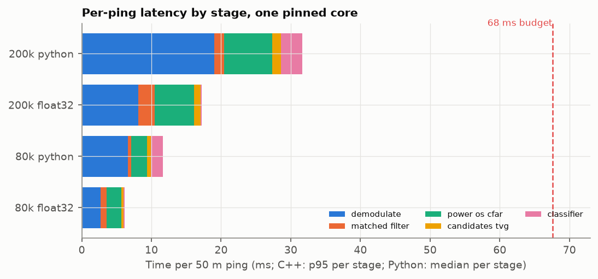
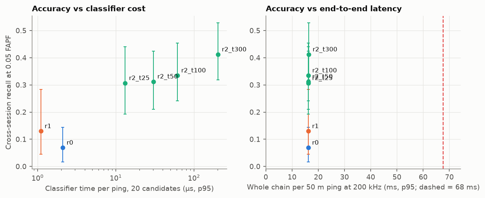

# W5: edge deployment (C++ front end, compiled classifier, latency budget)

The W2 front end and the W3 classifiers now run as dependency-free C++17 and C. Results match
Python to 2e-11 or better in double and 3e-7 in float32. A 50 m ping takes 16.4 ms at p95 at 200 kHz,
and 6.1 ms at 80 kHz, on one pinned laptop core: 24% and 9% of the 68 ms back-to-back budget.
Compiling R2 to float32 C costs 0.002 recall (interval includes zero). ARM timing still needs a
board. Code: [`edge/`](../edge/README.md). Decisions:
[401](decisions/401-edge-parity-strategy.md) (parity),
[402](decisions/402-trees-to-c-not-onnx-int8.md) (model export),
[403](decisions/403-benchmark-without-arm-board.md) (benchmark machine).

## Budget

At the 50 m setting a ping's echoes take 2 × 50 / 1480 = 67.6 ms to return. To ping back to
back, the device must finish each ping in that time.

## Parity with Python

| Block | Python reference | Double error | Float32 error |
| --- | --- | --- | --- |
| Band-pass, mix, low-pass, decimate | `echofind.dsp.demodulate` (scipy `sosfiltfilt`) | 5.1e-15 | 1.1e-7 |
| Matched filter (FFT) | `matched_filter` (scipy `fftconvolve`) | 4.8e-16 | 8.1e-8 |
| CA / GO / OS-CFAR, stride 1 and 4 | `cfar_threshold` | ≤ 7.4e-15 | ≤ 3.1e-7 |
| TVG 40 log r + 2αr | `apply_tvg` | 1.9e-11 | 6.8e-8 |
| R0, R1, R2 ×4 (generated C) | ladder models (LightGBM raw score) | ≤ 1e-9 of score range | same branches as double on float inputs |

Error is max |C++ − Python| / max |Python|. Plan criterion: 1e-5 in float32; met by 30× or
more. Sources: `ef_golden` ([golden.txt](w5/golden.txt), 9 of 9 pass) and
`tests/test_edge_parity.py` (11 pass; the pybind11 test runs in CI on Linux).

## Latency per 50 m ping

Intel Core i7-8850H, one core pinned, GCC 16.2 -O2, 500 pings, float32 unless stated
([`w5/benchmark.csv`](w5/benchmark.csv), [machine](w5/machine.json)). Python is the same
chain in `echofind.dsp` and LightGBM (median of 15 runs). Stage columns are p50 for C++ and
medians for Python.

| Setting | Build | Demodulate | Matched filter | Power + OS-CFAR | TVG + candidates | Classifier (20 cand.) | **Total p50 / p95** | Budget used (p95) | Peak RAM |
| --- | --- | --- | --- | --- | --- | --- | --- | --- | --- |
| 80 kHz, 27,300 samples | C++ float32 | 2.4 ms | 0.7 | 1.7 | 0.2 | 0.09 | **5.3 / 6.1 ms** | 9% | 7.5 MB |
| | C++ float64 | 2.7 | 1.2 | 1.8 | 0.2 | 0.13 | 6.1 / 9.2 | 14% | 8.7 MB |
| | Python | 6.7 | 0.4 | 2.3 | 0.6 | 1.7 | 11.6 (median) | 17% | — |
| 200 kHz, 65,520 samples | C++ float32 | 5.9 | 1.7 | 3.7 | 0.4 | 0.11 | **11.9 / 16.4 ms** | 24% | 9.6 MB |
| | C++ float64 | 6.8 | 2.7 | 3.9 | 0.4 | 0.15 | 14.4 / 21.5 | 32% | 12.8 MB |
| | Python | 19.0 | 1.4 | 6.9 | 1.2 | 3.0 | 31.6 (median) | 47% | — |

- **Demodulation is half the time.** Zero-phase filtering runs at the full passband rate
  (960 kHz) so that it matches SciPy exactly. Decimating first, with a polyphase front end,
  is the next speed-up if the ARM board needs one.
- **The C++ matched filter is slower than SciPy's** (1.7 against 1.4 ms). Its radix-2 FFT pads
  to 16,384 points, where SciPy uses an optimised mixed-radix FFT. The plan's pocketfft or
  KissFFT would close that gap. At 10% of the chain it is not the bottleneck.
- **The classifier is negligible:** 0.2 ms for 20 candidates at 300 trees. A rung's cost on
  the device is set by the front end, not the model.
- Worst-case latency on Windows reached 53 ms at 200 kHz, because of scheduler preemption
  (p95 16 ms). A device needs an isolated core or a real-time OS, and should report p99.9.

## Accuracy against cost

| Model | Cross-session recall @ 0.05 FAPF [95% CI] | Classifier p95 per ping (20 cand.) | Whole chain p95, 200 kHz |
| --- | --- | --- | --- |
| R0 rule | 0.07 [0.02, 0.14] | 2.1 µs | 16.2 ms |
| R1 logistic | 0.13 [0.05, 0.28] | 1.1 µs | 16.2 ms |
| R2, 25 trees | 0.31 [0.19, 0.44] | 13 µs | 16.2 ms |
| R2, 50 trees | 0.31 [0.21, 0.42] | 30 µs | 16.2 ms |
| R2, 100 trees | 0.33 [0.24, 0.45] | 61 µs | 16.2 ms |
| R2, 300 trees (deployed) | **0.41** [0.32, 0.53] | 203 µs | 16.4 ms |

The front end costs the same for every rung, so the Pareto front is flat in latency. On this
budget there is no reason to ship a smaller model: R2 at 300 trees is the best choice even on
a core 4× slower.

## Export cost: float32

Cross-session folds scored with double features and with float32-rounded features, using the
same models ([`w5/float32_cost.csv`](w5/float32_cost.csv)):

| | Recall @ 0.05 FAPF | PR-AUC |
| --- | --- | --- |
| R2, float64 | 0.412 [0.316, 0.559] | 0.541 |
| R2, float32 (what the C code sees) | 0.410 [0.313, 0.559] | 0.540 |
| Difference (paired) | **−0.002 [−0.007, +0.005]** | |

0.011% of alarm decisions flip. The plan's limit for recall lost to the export is 1 point, so
it is met. int8 is not used for trees (decision 402), so H8 is reported as this float32 cost
until a CNN rung exists.

## Sizes

| Artifact | Size |
| --- | --- |
| `ef_bench` (static, with all models and the C++ runtime) | 3.75 MB; 2.0 MB stripped |
| Generated models, machine code (6 models × 2 precisions) | 0.94 MB (R2-300 is about 63%) |
| Peak resident memory, 200 kHz ping | 9.6 MB (float32), 12.8 MB (float64) |

## Not done

- **ARM timing on a Raspberry Pi** (decision 403; commands in [edge/README.md](../edge/README.md)).
  The x86 numbers leave 4.1× headroom at 200 kHz.
- **The FLS feature extractor** (`echofind.features.fls`, image candidates to 38 features) is
  still Python only. A handheld single-beam device needs the 1-D equivalent, which W6 should
  specify from the features that mattered (shadow, level, extent).
- **Q15 fixed point** (a stretch goal) and a mixed-radix FFT.
- **aarch64 cross-build in CI.**
