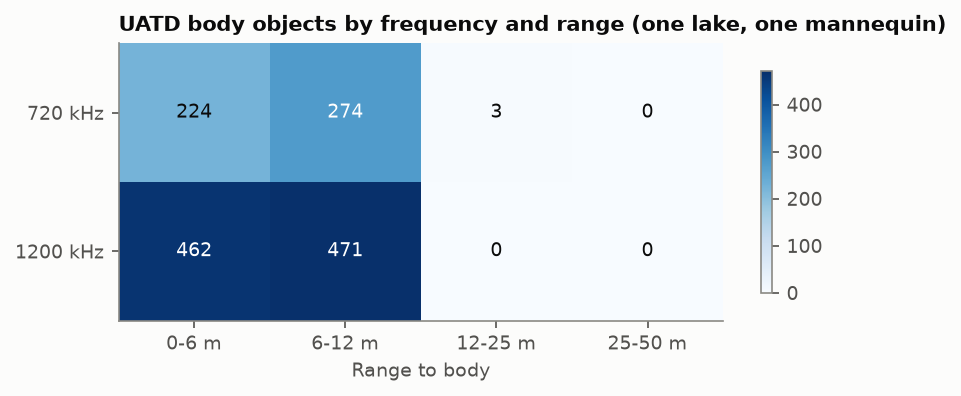
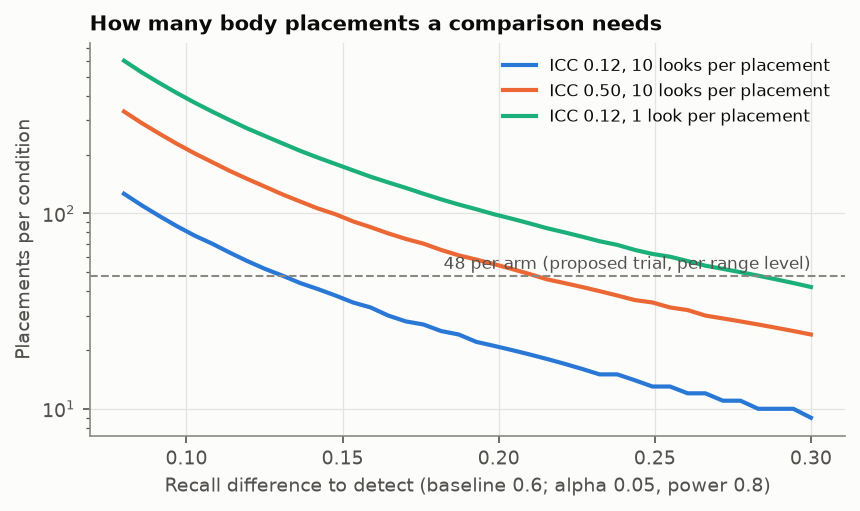

# What AquaEye should collect next

EchoFind memo · W6 · Oct 2026. Evidence: [W3](w3_ladder.md), [W4](w4_generalization.md),
[W5](w5_edge.md). Design files: [`w6/field_design.csv`](w6/field_design.csv),
[metadata schema](../configs/field_metadata.schema.json). Decisions:
[501](decisions/501-field-trial-design.md), [502](decisions/502-sample-size-planning-icc.md),
[503](decisions/503-simulation-role-and-sim-to-real.md).

## Recommendation

Run an 8-day trial: 4 sites × 2 days, 144 body-proxy placements, 32 confuser placements and
16 body-free sweeps. Record raw pings at both frequencies on every placement, with
GPS-and-camera ground truth and blinded labels. The trial answers the three questions the
public data cannot:
1. Does the detector hold when the frequency changes?
2. Does it hold past 12 m?
3. Does it hold for a body-like target that is not one particular mannequin?

The trial detects a 0.15 recall difference between conditions if looks at a placement are as
independent as they were in UATD. If they are more alike, it detects 0.20–0.25. A pilot day
tells which case holds before the other seven days run.

## Why the public data is not enough

| Gap (coverage audit, [`w6/coverage.csv`](w6/coverage.csv)) | What it cost us |
| --- | --- |
| One mannequin, in one lake, in 16 sessions (1,434 objects). No real body, no pose or clothing log | Every result is a proxy result. The plan assumes a body's echo matches a mannequin's |
| Frequencies come from different sessions (720 kHz at 1,474 m/s, 1,200 kHz at 1,466 m/s) | Frequency shift drops R2 from 0.41 to 0.08–0.21 recall. We cannot separate frequency from session |
| No bodies beyond 12 m (3 objects at 12–25 m, none at 25–50 m) | The 25–50 m range a handheld is sold for is untested; recall already falls from 0.49 to 0.34 by 9–12 m |
| No bottom type, depth or tilt logged; no bodies at sea | No per-bottom performance; lake → sea gives false alarms only |
| Bath side-scan: 73 target legs, no positions | No independent-site recall until a reviewer boxes them (about 4–6 hours) |

## Collect next, in priority order

1. **Both frequencies on every ping, in the same session.** This isolates the frequency effect
   (W3: every rung fails across frequency) and supports per-frequency models.
2. **Range 10, 20 and 50 m, in equal numbers.** No public data covers 12–50 m.
3. **A body-like target that is not a mannequin.** Use a tissue-equivalent phantom with
   lung-volume air, plus a mannequin as a link to the public data. A cadaver study is only
   worth it if an ethics board and a partner agency make it possible. Measure target strength
   against aspect at both frequencies: the W2 simulator's −20 dB is an assumption.
4. **Confusers placed beside the body sites:** tyre, log, rock pile, debris bag. W3 found that
   false alarms come from placed objects (balls, tyres, cages), not from open water.
5. **A body-free sweep at the start and end of each day.** Decision 303: 50–100 such frames
   reset the false-alarm threshold at a new site. Here they are cheap and they test that
   step directly.
6. **IMU tilt and heading on every ping, and raw samples, not screenshots.** These close the
   FMEA tilt gap. Re-processing is impossible without raw data.
7. **Stopwatch times for checking an alarm and for re-searching.** The mission-cost optimum
   moves from 0.008 to 0.54 false alarms per frame across plausible times (decision 301).

## Trial design

- **Blocks:** site × day. The four sites differ by bottom (mud, sand, rock, weed), so bottom
  is a block-level factor with one site per level. Its effect is confounded with site; that
  is stated, not hidden.
- **Within each block:** a complete replicate of range (10/20/50 m) × pose (prone, supine,
  curled) × clothing (light, heavy). That is 18 body placements, plus 4 confusers and the 2
  body-free sweeps: 24 slots, about 15 minutes each.
- **Order** within a day is random (`w6/field_design.csv`, seed 0). Both frequencies record on
  every ping, so frequency is a paired, within-placement comparison: the strongest design for
  the most important question.
- **Each placement:** 3 passes from a logged operator position, at a random body heading that
  is logged, giving about 10 looks (correlated; see Sample size). Ground truth comes from a GPS-tagged buoy and
  a drop camera or diver, confirmed before the first pass.
- **Analysis**, written before the data exists: recall at the fixed false-alarm rate per
  condition, with the placement as the unit. Use a cluster bootstrap or a mixed model with a
  random placement effect. Pre-registered contrasts: high vs low frequency (paired), 50 vs
  10 m, phantom vs mannequin, and each bottom vs sand.

## Sample size

Looks at one placement are correlated, so each condition needs placements, not pings
(decision 502). UATD gives an intraclass correlation of 0.12 [0.02, 0.24] for "found" across
looks in a session (`w6/icc.json`). Repeated looks at one real placement are probably more
alike, so the plan also uses 0.5.

| Contrast (48 placements per arm, 10 looks each) | Power, ICC 0.12 | Power, ICC 0.5 |
| --- | --- | --- |
| Recall difference 0.10 | 0.57 | 0.27 |
| 0.15 | 0.89 | 0.52 |
| 0.20 | 0.99 | 0.74 |
| 0.25 | 1.00 | 0.91 |

Monte Carlo with beta-binomial placements, α 0.05 ([`w6/trial_power.csv`](w6/trial_power.csv)).
The formula is checked by simulation in `tests/test_power.py`.

Reading: when looks are alike, more looks buy little; more placements and more sites do. If
the pilot day measures an ICC above 0.3, add a third day per site before adding passes.
Pose has 3 levels at 48 placements each. Clothing has 2 at 72 each.

## Labelling and QA

- **Labels:** labellers see raw pings and placement IDs, never the placement log. Each
  candidate gets body, not body, unsure or unusable, with confidence A/B/C, as in the Bath
  protocol.
- **Agreement:** double-label a random 10%. Report Cohen's kappa and the range/bearing
  agreement. A third labeller adjudicates. Kappa below 0.6 stops labelling until the
  definitions are fixed.
- **Automatic checks** on every pass: input QA (saturation, dropped rows, dead beams, low
  signal; `echofind.eval.qa`), tilt out of range, a file hash, and schema validation of the
  metadata ([schema](../configs/field_metadata.schema.json); `tests/test_field_schema.py`
  rejects records with no raw data, no IMU, no ground truth or unblinded labels).

## Where simulation fits

- **Can fill:** geometry (range, tilt, beam footprint), SNR against range, multipath,
  reverberation level by bottom type, and noise (W2, using real MBARI recordings). It is good
  for planning ranges and testing the DSP.
- **Cannot fill:** the target strength of a real body against aspect and frequency; clothing
  and trapped air; how a body lies on weed or rock; and real confusers.
- **Sim-to-real test**, pre-registered (decision 503). After calibrating one target-strength
  offset per frequency on day 1:
  1. Simulated SNR against range must match measured SNR within 3 dB RMS on days 2–8.
  2. The measured clutter K-shape per bottom must fall inside the simulator's range.
  3. A detector trained on simulation only must lose no more than 0.15 recall against one
     trained on field data.

  If the test fails, simulation stays a DSP test bench and stops being a data source.

## Cost of not doing this

Without paired-frequency, long-range and non-mannequin data, any accuracy figure AquaEye
quotes is a single-lake mannequin number, at the 5–12 m ranges where the public data happens
to sit.
